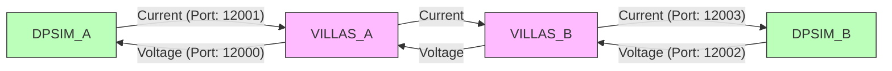

# DESF Two-Laboratory Distributed Power Simulation Example

This example demonstrates a distributed power system simulation using the DESF (Distributed Electric Simulation Framework) architecture. It showcases how multiple laboratories can be connected to form a cohesive workbench for real-time co-simulation of electrical systems.

## TL;DR

Run `./run_complete_simulation.sh` to start the DPSim and DESF simulations in one go and generate the simulation plots.

## DESF Entities Overview

The example implements a hierarchical structure of DESF entities:



## Diagram

The diagram above illustrates the signal exchange between the DPSim compute nodes and VILLASnode communication nodes, showing how current and voltage measurements flow between the components.


### Workbench Entity
The top-level entity that coordinates multiple laboratories. In this example, the workbench connects Laboratory A and Laboratory B to perform a distributed power simulation.

- **Name**: DESF Simulation Workbench
- **Type**: Workbench
- **Description**: Group of 2+ Laboratories that need to communicate for distributed simulation
- **Laboratories**: Laboratory A, Laboratory B

### Laboratory Entities
Each laboratory represents an independent simulation environment with its own compute and communication nodes.

#### Laboratory A
- **Type**: Laboratory
- **Description**: Collection of 1 Compute Node, 1 Communication Node for distributed simulation
- **Components**:
  - DPSim Compute Node (electric simulation)
  - VILLASnode Communication Node (network communication)

#### Laboratory B
- **Type**: Laboratory
- **Description**: Collection of 1 Compute Node, 1 Communication Node for distributed simulation
- **Components**:
  - DPSim Compute Node (electric simulation)
  - VILLASnode Communication Node (network communication)

### Node Entities

#### Compute Nodes
Responsible for running the actual power system simulations:

- **DPSim Lab A**: Simulates a voltage source circuit with resistor and inductor
- **DPSim Lab B**: Simulates a current source circuit with resistors and a switch

#### Communication Nodes
Handle data exchange between laboratories:

- **VILLASnode Lab A**: Manages communication for Laboratory A
- **VILLASnode Lab B**: Manages communication for Laboratory B

#### Orchestrator Node
- **API Orchestrator**: Central service that can provide simulation parameters and coordinate the distributed simulation

### Network Entity
- **DESF Shared Network**: Bridge network that enables communication between all laboratories

## Simulation Overview

This example implements a distributed power simulation where:

1. Laboratory A simulates a voltage source circuit with an inductor
2. Laboratory B simulates a current source circuit with resistors and a switch
3. The laboratories exchange data via UDP through their respective VILLASnode instances:
   - Lab A sends current measurements to Lab B
   - Lab B sends voltage measurements to Lab A
4. The simulation runs in real-time with configurable time steps

## Directory Structure

```
2labs_dp/
├── docker-compose.yaml       # Main workbench configuration
├── lab_a/                    # Laboratory A
│   ├── app/                  # Simulation application
│   │   └── dpsim_lab_a_dp.py # DPSim simulation for Lab A
│   ├── config/               # VILLASnode configuration
│   ├── logs/                 # Simulation logs
│   └── docker-compose.yaml   # Lab A service definitions
└── lab_b/                    # Laboratory B
    ├── app/                  # Simulation application
    │   └── dpsim_lab_b_dp.py # DPSim simulation for Lab B
    ├── config/               # VILLASnode configuration
    ├── logs/                 # Simulation logs
    └── docker-compose.yaml   # Lab B service definitions
```

## Running the Example

To run the distributed simulation:

```bash
cd /path/to/desf/examples/2labs_dp
docker compose --env-file ./.env up
```

This will start all services defined in the main docker-compose.yaml file, which extends the laboratory-specific service definitions.

## Key Features

- **Real-time Simulation**: Both laboratories run with real-time scheduling
- **Distributed Architecture**: Clear separation between laboratories and their components
- **Orchestration**: Optional API for centralized parameter management
- **Resource Management**: Configurable CPU and memory limits for each service
- **Labeled Entities**: DESF entity labels for clear identification of components

## Technical Details

- **Communication**: UDP-based data exchange between laboratories
- **Simulation Engine**: DPSim (Dynamic Phasor Simulation)
- **Network Interface**: VILLASnode
- **Containerization**: Docker with docker-compose
